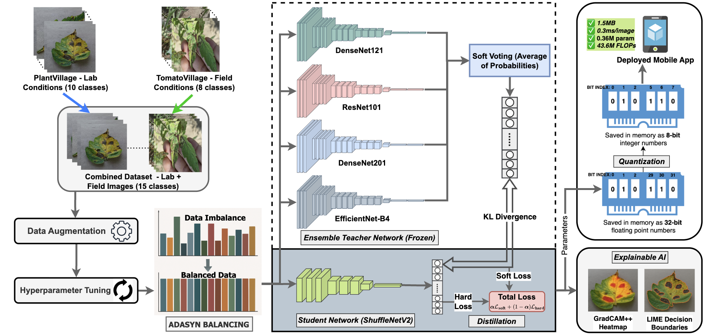

# TomatoLeaf-AI: Cross-Domain Tomato Leaf Disease Detection

[](https://opensource.org/licenses/MIT)
[](https://www.python.org/downloads/)
[](https://pytorch.org/)
[](https://github.com/junayed-hasan/lightweight-tomato)
[](https://github.com/junayed-hasan/lightweight-tomato)



## 🌟 Overview

**TomatoLeaf-AI** is the first comprehensive framework for cross-domain tomato leaf disease detection, bridging the gap between laboratory research and real-world agricultural deployment. This repository implements a unified optimization approach integrating ensemble learning, knowledge distillation, and quantization for edge-compatible disease detection.

### 🎯 Key Contributions

- **First Open Cross-Domain Benchmark**: Unifying PlantVillage and TomatoVillage datasets into 15 harmonized disease classes
- **Unified Optimization Framework**: Integrating ensemble learning, knowledge distillation, and quantization
- **Edge-Compatible Deployment**: Achieving 671× compression (1.46 MB) with 97.46% accuracy
- **Real-World Validation**: Multilingual Flutter mobile application for field deployment
- **Explainable AI**: Grad-CAM++ and LIME-based interpretability analysis

### 📊 Performance Highlights

| Model | Accuracy | F1-Score | Parameters | Size | Inference Time |
|-------|----------|----------|------------|------|----------------|
| Ensemble (Teacher) | 99.15% | 97.07% | 163M | 652 MB | 12.6ms |
| ShuffleNetV2 (Student) | 98.53% | 96.12% | 1M | 4.2 MB | 0.29ms |
| Quantized INT8 | 97.46% | 95.36% | 1M | 1.46 MB | 0.29ms |

## 🏗️ Repository Structure

```
TomatoLeaf-AI/
├── src/                          # Source code
│   ├── configurations/           # Configuration files
│   ├── data_augmentation/        # Data augmentation strategies
│   ├── data_balancing/          # ADASYN-based balancing
│   ├── datasets/                # Dataset loaders and utilities
│   ├── distillation/            # Knowledge distillation
│   ├── ensemble/                # Ensemble learning
│   ├── evaluation/              # Model evaluation scripts
│   ├── explainable_ai/          # Interpretability analysis
│   ├── hyperparameter_tuning/   # Hyperparameter optimization
│   ├── models/                  # Model architectures
│   ├── quantization/            # Model quantization
│   └── utils/                   # Utility functions
├── data/                        # Datasets
│   ├── combined/                # Unified dataset
│   ├── plantvillage/           # PlantVillage dataset
│   └── tomatovillage/          # TomatoVillage dataset
├── docs/                        # Documentation
├── scripts/                     # Training and evaluation scripts
├── mobile_app/                  # Flutter mobile application
├── outputs/                     # Model outputs and results
└── checkpoints/                 # Trained model checkpoints
```

## 🚀 Quick Start

### Prerequisites

```bash
# Python 3.8+ required
pip install -r requirements.txt
pip install -r requirements_balancing.txt
```

### Dataset Preparation

1. **Download Datasets**:
   ```bash
   # PlantVillage dataset
   wget [PlantVillage_URL] -O data/plantvillage/
   
   # TomatoVillage dataset  
   wget [TomatoVillage_URL] -O data/tomatovillage/
   ```

2. **Create Combined Dataset**:
   ```bash
   python src/datasets/dataset.py --create_combined
   ```

### Training Pipeline

#### 1. Baseline Training
```bash
python scripts/train.py --model densenet121 --epochs 100 --batch_size 32
```

#### 2. Ensemble Training
```bash
python src/ensemble/train_best_ensemble.py --models densenet121,resnet101,densenet201,efficientnet_b4
```

#### 3. Knowledge Distillation
```bash
python src/distillation/train_best_kd.py --teacher_ensemble --student shufflenet_v2 --temperature 5
```

#### 4. Quantization
```bash
python src/quantization/mobile_quantization_pipeline.py --model shufflenet_v2 --quantization int8
```

### Evaluation

```bash
# Cross-domain evaluation
python src/evaluation/evaluate_kd_on_test_datasets.py --model_path checkpoints/best_kd_model.pth

# Interpretability analysis
python src/explainable_ai/interpretability_analysis.py --model_path checkpoints/best_model.pth
```

## 📱 Mobile Deployment

The repository includes a Flutter-based mobile application for real-world deployment:

```bash
cd mobile_app/
flutter pub get
flutter run
```

**Features**:
- Real-time disease detection
- Multilingual support (English, Bengali, Spanish)
- Offline inference capability
- Treatment recommendations

## 🔬 Research Methodology

### Cross-Domain Benchmark

Our framework addresses three fundamental challenges:

1. **Cross-Domain Generalization**: Unified PlantVillage (lab conditions) and TomatoVillage (field conditions) datasets
2. **Class Imbalance**: ADASYN-based balancing for 75:1 imbalance ratio
3. **Computational Constraints**: Knowledge distillation and quantization for edge deployment

### Optimization Pipeline

1. **Data Preprocessing**: Strategic augmentation and ADASYN balancing
2. **Hyperparameter Tuning**: Systematic optimization across 24 architectures
3. **Ensemble Learning**: Four-model soft voting ensemble
4. **Knowledge Distillation**: Teacher-student framework with temperature scaling
5. **Quantization**: INT8 quantization for mobile deployment

### Explainable AI

- **Grad-CAM++**: Attention visualization for model interpretability
- **LIME**: Local interpretable model-agnostic explanations
- **Biological Validation**: Alignment with plant pathology principles

## 📈 Experimental Results

### Cross-Dataset Performance

| Dataset | Accuracy | F1-Score | Precision | Recall |
|---------|----------|----------|-----------|--------|
| Combined Test | 99.15% | 97.07% | 97.23% | 96.91% |
| PlantVillage | 98.87% | 96.45% | 96.78% | 96.12% |
| TomatoVillage | 95.70% | 93.62% | 94.01% | 93.23% |

### Computational Analysis

| Model | Parameters | FLOPs | Memory | Inference Time |
|-------|------------|-------|--------|----------------|
| DenseNet-121 | 7.98M | 2.87G | 32.4 MB | 3.2ms |
| ResNet-101 | 44.55M | 7.83G | 179.8 MB | 4.1ms |
| ShuffleNetV2 | 1.26M | 146M | 5.1 MB | 0.29ms |
| Quantized INT8 | 1.26M | 146M | 1.46 MB | 0.29ms |

## 🏆 Disease Classes

The framework detects 15 tomato leaf disease classes:

1. **Healthy**
2. **Bacterial Spot**
3. **Early Blight**
4. **Late Blight**
5. **Leaf Mold**
6. **Septoria Leaf Spot**
7. **Spider Mites**
8. **Target Spot**
9. **Yellow Leaf Curl Virus**
10. **Mosaic Virus**
11. **Powdery Mildew**
12. **Nutrient Deficiency**
13. **Pest Damage**
14. **Environmental Stress**
15. **Other Diseases**

## 📚 Documentation

Detailed documentation is available in the `docs/` directory:

- [Installation Guide](docs/INSTALL_ONNX_DEPENDENCIES.md)
- [Knowledge Distillation](docs/KD_README.md)
- [Data Balancing](docs/README_balancing.md)
- [Augmentation Experiments](docs/README_AUGMENTATION_EXPERIMENTS.md)
- [Computational Analysis](docs/README_COMPUTATIONAL_ANALYSIS.md)
- [Interpretability Analysis](docs/README_INTERPRETABILITY.md)

## 🤝 Contributing

We welcome contributions! Please see our contributing guidelines:

1. Fork the repository
2. Create a feature branch (`git checkout -b feature/amazing-feature`)
3. Commit your changes (`git commit -m 'Add amazing feature'`)
4. Push to the branch (`git push origin feature/amazing-feature`)
5. Open a Pull Request

## 📄 Citation

If you use this work in your research, please cite:

```bibtex
@article{hasan2024tomatoleaf,
  title={TomatoLeaf-AI: Cross-Domain Tomato Leaf Disease Detection with Unified Optimization Framework},
  author={Mohammad Junayed Hasan},
  journal={arXiv preprint arXiv:2024.xxxxx},
  year={2024}
}
```

## 📞 Contact

**Mohammad Junayed Hasan**
- Email: [your-email@domain.com]
- GitHub: [@junayed-hasan](https://github.com/junayed-hasan)
- LinkedIn: [Your LinkedIn Profile]

## 📜 License

This project is licensed under the MIT License - see the [LICENSE](LICENSE) file for details.

```
MIT License

Copyright (c) 2024 Mohammad Junayed Hasan

Permission is hereby granted, free of charge, to any person obtaining a copy
of this software and associated documentation files (the "Software"), to deal
in the Software without restriction, including without limitation the rights
to use, copy, modify, merge, publish, distribute, sublicense, and/or sell
copies of the Software, and to permit persons to whom the Software is
furnished to do so, subject to the following conditions:

The above copyright notice and this permission notice shall be included in all
copies or substantial portions of the Software.

THE SOFTWARE IS PROVIDED "AS IS", WITHOUT WARRANTY OF ANY KIND, EXPRESS OR
IMPLIED, INCLUDING BUT NOT LIMITED TO THE WARRANTIES OF MERCHANTABILITY,
FITNESS FOR A PARTICULAR PURPOSE AND NONINFRINGEMENT. IN NO EVENT SHALL THE
AUTHORS OR COPYRIGHT HOLDERS BE LIABLE FOR ANY CLAIM, DAMAGES OR OTHER
LIABILITY, WHETHER IN AN ACTION OF CONTRACT, TORT OR OTHERWISE, ARISING FROM,
OUT OF OR IN CONNECTION WITH THE SOFTWARE OR THE USE OR OTHER DEALINGS IN THE
SOFTWARE.
```

## 🙏 Acknowledgments

- PlantVillage dataset contributors
- TomatoVillage dataset contributors
- PyTorch and timm library developers
- Flutter development team
- Agricultural research community

---

<div align="center">
  <strong>🌱 Bridging AI Research and Agricultural Reality 🌱</strong>
</div> 